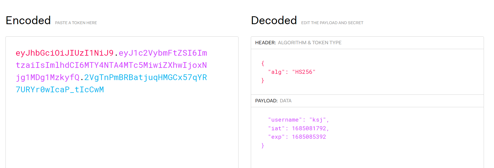

# SpringSecurity

## 인증 (Authentication)

사용자의 신원을 확인하는 절차 

## 인가(Authorization)

사용자의 권한을 확인하고 허가하는 절차 

## 무상태성(Stateless)

HTTP통신에서 서버는 이전 요청과 현재요청의 맥락을 기억하지 못한다.

## 사용자에 대한 정보를 전달하는 헤더 

1. from : 사용자의 이메일 주소
2. user-agent : 사용자의 브라우저
3. referer : 사용자가 현재 링크를 타고 온 근원 페이지
4. authorization : 사용자의 이름과 비밀번호 

## 쿠키 세션 (Key : value)

- 쿠키
  - 브라우저에 저장됨 
  - 클라이언트 상태 정보
  - 사용자가 요청하지 않아도 Header에 담겨서 전송

- 세션 
  - 서버에서 관리 
  - 세션ID를 부여하여 구분

## 세션 쿠키 인증허가 과정 

사용자가 로그인 요청 POST { username : "ksj", password : "1234" }
세션 ID를 서버에서 반환 Set-Cookie : sessionId=dsfvsd
사용자는 Cookie:sessionId=dsfvsd에 정보를 담아서 전달한다. 

 - 문제점 
   - 하나의 서버에서만 가능하다(!=MSA).
     - sticky session : 로드 벨런서가 클라이언트의 요청을 세션을 생성한 서버로만 전달 
     - session clustering : 모든 서버의 세션 동기화
     - 별도의 세션 저장 cache : Redis, Memcached

## JWT 인증 

클라에서 ID, PWD login
서버에서 정보를 싸인하고 전달한다. 
클라는 받은 토큰으로 다시 요청 
서버에서 그 싸인이 유효한지 체크한다. 


    Header : eyJhbGciOiJIUzI1NiJ9.

    Payload :eyJ1c2VybmFtZSI6ImtzaiIsImlhdCI6MTY4NTA4MTc5MiwiZXhwIjoxNjg1MDg1MzkyfQ.  

    Signature : 2VgTnPmBRBatjuqHMGCx57qYR7URYr0wIcaP_tIcCwM




```java
return Jwts.builder()
    .setClaims(claims)
    .setIssuedAt(new Date(System.currentTimeMillis()))
    .setExpiration(new Date(System.currentTimeMillis() + expireTimeMs))
    .signWith(SignatureAlgorithm.HS256, key)
    .compact();
```
Json -> RSA, BASE.. -> WebToken
 - Header : 토큰의 타입 , 해싱 알고리즘
 - Payload : Claims
 - Signature : header와 payload를 합친 문자열을 서버의 비밀키와 함께 서명한 값

Authorization : Bearer jwt로 요청이 온다.

### 문제점 

- 쿠키, 세션과 다르게 길이가 길다. 
- payload는 암호화 되지 않는다.(토큰이 암호화 되면 서버에서도 이를 체크 불가능) 
- 토큰이 탈취 당할 수 있다.  
- 서버에 누가 로그인 했는지 알 수 없다. (기한만 체크한다.)

## 소셜 로그인 OAuth

- OAuth : 인가
  - OAuth1.0, OAuth2.0
- OpenID : 인증

## OAuth 용어

- Resource Owner : 사용자
- Client : OAuth를 이용하려는 서비스
- Authorizaton Server : (구글) 인증 서버 : 토큰 발행 
- Resource Server : (구글) 자원 서버 : 데이터 보관 
- Scope : 클라이언트가 허용된 범위 


## OpenID 개방형 표준 및 분산 인증 프로토콜

- 1.0 2.0 OIDC ..
- 신뢰할 수 있는 서비스에 인증정보 위임 그것으로 다른 여러 사이트들 인증 
- IDP : OpenID 제공자(네이버 , 카카오)
- RP : Idp를 사용하는자 
- OpenIDConnect(OIDC) : OAuth 위에서 작동한다.  
- Http Scope:openid 추가

## 둘의 차이는?

- OAuth : AccessToken를 발급받고 이를 통해서 리소스 서버 접속 
- OIDC : ID Token를 발급받고 사용자 식별 정보를 얻기 위해서 사용된다. 
  - ID Token : 사용자 정보가 있는 JWT 
- OAuth만 사용하면 되는거 아님?
  - 서버의 리소스 접근권한은 있는데 프로필 정보를 얻지 못한다. => OIDC
  - 한번에 얻어올 수 있다.

## 부록 : CORS 

URL : **Protocol + Host + Port** + Path(uri) + Query St(정보) + Fragment(부분)
same origin : protocol, port, host를 통해 같은 출처라고 판단한다.

http://localhost:80 == http://localhost == http://localhost/api/user
!= https://localhost != http://127.0.0.1(String 비교를 한다.)

SOP(Same Origin Policy ) : 다른 출처의 리소스를 사용하는것을 제한하는것 
CORS(Corss Origin Resource Sharing) : 추가 Http 헤더를 이용하여 출처에서 실행중인 웹 어플리케이션이
다른 출처의 선택한 자원에 접근할 수 있는 권한을 부여하도록 브라우저에 알려주는 체제. 

### 단계 

https://developer.mozilla.org/en-US/docs/Web/HTTP/Headers/Referrer-Policy

`
Referrer-Policy: no-referrer
Referrer-Policy: no-referrer-when-downgrade
Referrer-Policy: origin
Referrer-Policy: origin-when-cross-origin
Referrer-Policy: same-origin
Referrer-Policy: strict-origin
Referrer-Policy: strict-origin-when-cross-origin
Referrer-Policy: unsafe-url
`

- Simple Request
  - GET, POST, HEAD
  - Content-Type 
    - application/x-www-form-urlencoded
    - multipart/form-data
    - text/plain
  - 헤더는 Accept, Accept-Language, Content-Language, Content-Type 만 허용
  

- Preflight Request
  - OPTIONS 메소드를 통해 다른 도메인의 리소스에 요청이 가능한지 확인 
  ```http request
  # 요청 
    OPTIONS /resource/foo
    Access-Control-Request-Method: DELETE
    Access-Control-Request-Headers: origin, x-requested-with
    Origin: https://foo.bar.org
  
  #응답 
  Access-Control-Allow-Origin : 서버 측 허가 출처
  Access-Control-Allow-Methods: 서버측 허가 메서드
  Access-Control-Allow-Headers: 서버측 허가 헤더 
  Access-Control-Max-size :preflight 응답 캐시 시간 
     HTTP/1.1 204 No Content
    Connection: keep-alive
    Access-Control-Allow-Origin: https://foo.bar.org
    Access-Control-Allow-Methods: POST, GET, OPTIONS, DELETE
    Access-Control-Max-Age: 86400
  ```
  - 응답 바디는 비어있어야 한다.
  - 응답 코드 200번대


- Credentialed Request 
  - 인증 관련 헤더를 포함할 때 사용하는 요청이다.
  - client credentials:include
  - server Access-Control-Allow-Credentials:true